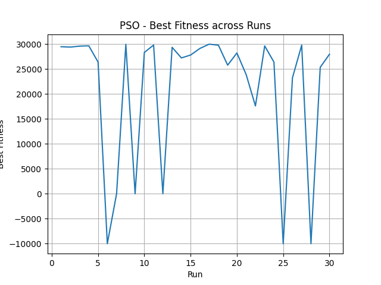
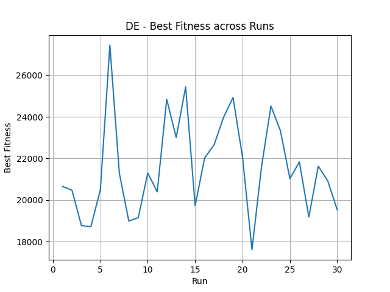
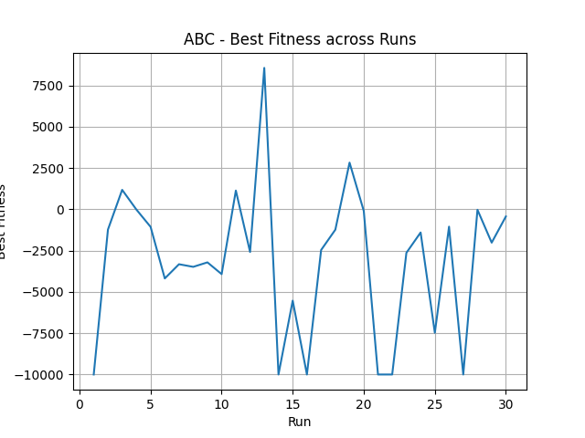
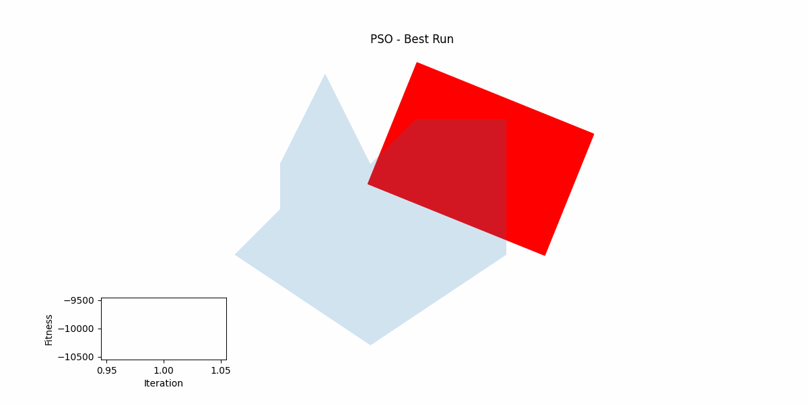
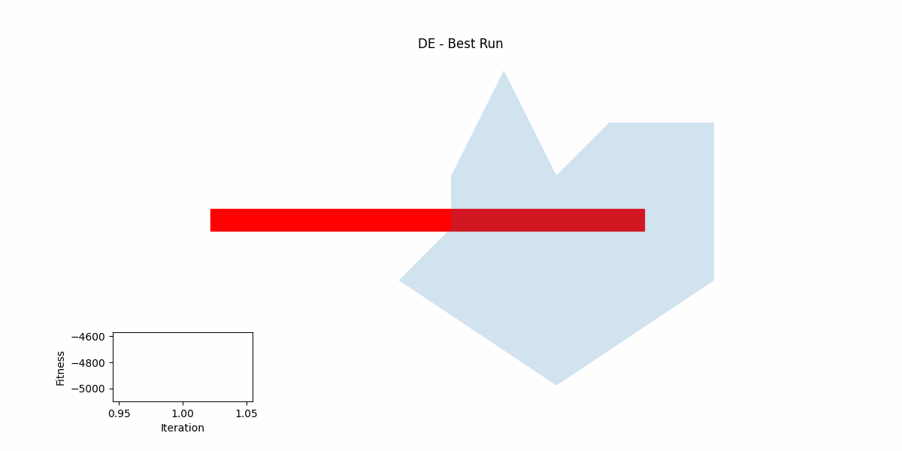
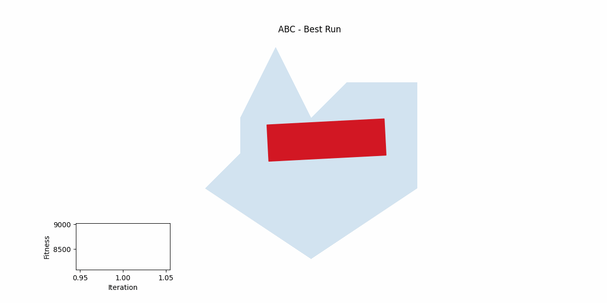

# Optim-PSO-DE-ABC

This project provides a general framework for implementing and comparing three popular optimization algorithms: Particle Swarm Optimization (PSO), Differential Evolution (DE), and Artificial Bee Colony (ABC). These algorithms are designed to be adaptable to a wide range of optimization problems by simply modifying the objective function, bounds, and other parameters.

## Setup

First, install the required Python packages:
`pip install -r requirements.txt`

## Overview

The project is designed to be flexible and can be applied to various optimization tasks. By defining your own objective function, constraints, and other parameters, you can use these algorithms to solve problems in different fields.

## Project Structure

### `methods.py`
This file contains the basic implementation of the three optimization algorithms:

1. **Particle Swarm Optimization (PSO)**: A population-based optimization technique inspired by the social behavior of birds flocking or fish schooling.
   - **Classes**:
     - `Pso.Parameters`: Stores parameters for the PSO algorithm, such as the objective function, bounds, and coefficients.
     - `Pso.Particle`: Represents a single particle in the PSO algorithm, including its position, velocity, and fitness.
   - **Key Methods**:
     - `init_particles`: Initializes particles based on the provided bounds and dimensions.
     - `update`: Updates the velocities and positions of particles.
     - `move`: Moves the particles based on their velocities.
     - `pso`: Executes the PSO algorithm for a specified number of cycles.

2. **Differential Evolution (DE)**: A population-based optimization algorithm that uses mutation, crossover, and selection operators.
   - **Classes**:
     - `De.Parameters`: Contains parameters for the DE algorithm, such as the objective function, bounds, and mutation factors.
     - `De.Individual`: Represents an individual in the DE algorithm, including its position and fitness.
   - **Key Methods**:
     - `init_population`: Initializes the population based on the provided bounds.
     - `mutate`: Creates a new individual by combining the target individual's position with a scaled difference of other individuals.
     - `de`: Executes the DE algorithm for a specified number of generations.

3. **Artificial Bee Colony (ABC)**: An optimization algorithm based on the foraging behavior of bees.
   - **Classes**:
     - `Abc.Parameters`: Stores parameters for the ABC algorithm, such as the objective function, bounds, and the number of bees.
     - `Abc.FoodSource`: Represents a food source in the ABC algorithm, including its position and fitness.
   - **Key Methods**:
     - `init_population`: Initializes the population of food sources.
     - `select_food_sources`: Selects food sources based on a probability proportional to their fitness.
     - `scout_bees_phase`: Replaces depleted food sources with new random sources.
     - `abc`: Executes the ABC algorithm for a specified number of iterations.

## How to Use

1. **Define Your Problem**:
   - Implement your own objective function that calculates fitness based on parameters.
   - Set up the bounds, dimensions, and other algorithm-specific parameters.
   
2. **Run the Algorithms**:
   - Instantiate the optimization algorithm classes and their parameters.
   - Call the appropriate methods (`pso`, `de`, or `abc`) to run the optimization.

3. **Analyze the Results**:
   - Use the provided plotting functions to visualize the optimization process and analyze the results.

### Example Use Case: Maximizing a Rectangle within a Polygon
The `main.py` demonstrates the application of the three algorithms to the problem of maximizing the area of a rectangle inside a polygon.

- **Objective Function**: Calculates the area of the rectangle that fits within a specified polygon.
- **Setup**: Defines the bounds, dimensions, and other relevant parameters for each algorithm.
- **Visualization**: Includes functions to visualize the optimization process, such as generating GIF animations and plotting the progression of the best fitness values across multiple runs.

## Results

### Key Performance Indicators (KPIs)

For each optimization method, we track the progress of the optimization across multiple runs. This is visualized in the plots stored in the `KPI` directory. These plots provide insight into how each method converges towards the optimal solution over time.

- **PSO**:
  - 
  
- **DE**:
  - 
  
- **ABC**:
  - 

### Animations

To further illustrate the optimization process, animations have been created for each method, showing the best solution's evolution during the best run. These animations are stored in the `Animation` directory.

- **PSO**:
  - 
  
- **DE**:
  - 
  
- **ABC**:
  - 

> **Note:** There might be some display issues with the ABC method in the animation... 

